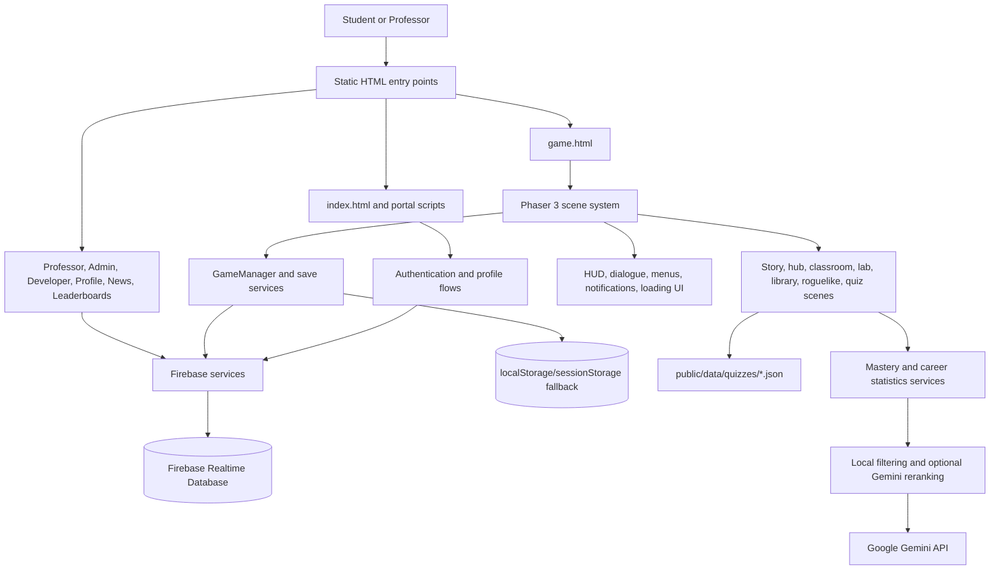

# SCI-HIGH

SCI-HIGH is a browser-based educational adventure game that teaches programming through story-driven exploration, quizzes, and game mechanics. It combines an interactive Phaser game with web dashboards for authentication, student progress, leaderboards, professor analytics, and custom quiz authoring.


---

## Key Features

* **Game-based programming education:** Students explore story scenes, classrooms, a computer lab, and a library while completing programming challenges and quizzes.
* **Adaptive, Bloom-aligned quizzes:** Multiple-choice, syntax-block, and code-arrangement questions are organized by intensity and Bloom taxonomy level. Optional Gemini reranking uses anonymized learning metadata to prioritize useful questions.
* **Progression and gamification:** The game tracks health, points, streaks, achievements, course progress, mastery, save data, and leaderboard submissions.
* **Cloud-connected student experience:** Firebase Authentication and Realtime Database support user sessions, gameplay records, custom quizzes, profile data, and cross-device synchronization, with local storage fallbacks for limited/offline use.
* **Professor and administration tools:** Professor dashboards provide student management, analytics, exports, and custom quiz creation. Separate pages support administration, developer utilities, profiles, news, and global leaderboards.
* **Responsive game presentation:** Phaser scenes use responsive scaling, orientation handling, touch and mouse input, audio, loading overlays, notifications, and mobile-safe UI utilities.

---

## Tech Stack

| Layer | Technology |
| :--- | :--- |
| **Frontend** | HTML, CSS, vanilla JavaScript (ES modules), Tailwind CSS via CDN |
| **Game Engine** | Phaser 3.88.2 |
| **Build Tool** | Vite 6.3.5 with a multi-page build configuration |
| **Backend Services** | Firebase Authentication and Firebase Realtime Database |
| **AI / Adaptivity** | Google Gemini API for optional metadata-only quiz reranking |
| **Data** | JSON question banks, browser `localStorage`/`sessionStorage`, Firebase data |
| **Visualization** | Chart.js for dashboard and leaderboard analytics |
| **Deployment** | Static hosting compatible with Vite output, including GitHub Pages |

---

## System Architecture



### Runtime Flow

1. Vite serves the static HTML pages and JavaScript modules.
2. `index.html` provides the main portal and authentication entry point.
3. Authenticated users open `game.html`, which initializes Firebase when configured and loads `src/game.js`.
4. Phaser starts the scene graph, beginning with startup/menu scenes and routing into the hub, story, learning, and quiz experiences.
5. Quiz results update mastery, points, achievements, course progress, and career statistics.
6. Firebase persists available user and gameplay data; local browser storage supports saves and offline or limited-mode fallback behavior.

---

## Project Pages

| Page | Purpose |
| :--- | :--- |
| `index.html` | Main SCI-HIGH portal, authentication, assistant, news, and navigation |
| `game.html` | Authenticated Phaser game experience |
| `leaderboards.html` | Global rankings and performance visualizations |
| `professor-dashboard.html` | Student analytics, exports, and custom quiz management |
| `profile.html` | User profile and account settings |
| `admin.html` | Administrative controls |
| `developer.html` | Developer tools and diagnostics |
| `news.html` | News and maintenance information |

---

## Getting Started

### Prerequisites

- Node.js and npm
- A browser with JavaScript enabled
- Firebase configuration for cloud features (optional for limited local development)
- A Gemini API key only if adaptive AI reranking is enabled

### Installation

```bash
npm install
```

### Development

```bash
npm run dev
```

Open the Vite URL shown in the terminal. The main portal is available at `/`, and the playable experience is available at `/game.html` after authentication.

### Production Build

```bash
npm run build
npm run preview
```

The build output is written to `dist/` and includes the configured multi-page entry points and static assets.

---

## Content Authoring

Course quiz data lives under `public/data/quizzes/`. Supported question formats include multiple choice, syntax-block selection, and code arrangement. New questions should include a `bloomTarget`; see [documentation/BloomQuestionAuthoring.md](documentation/BloomQuestionAuthoring.md) for the schemas and authoring checklist.

## Repository Structure

```text
src/          Phaser game, scenes, UI, services, and utilities
public/       Static assets, fonts, audio, images, and quiz data
js/           Portal, dashboard, leaderboard, and page-specific scripts
assets/       Shared configuration and web assets
documentation/Guides and acceptance criteria
*.html        Vite multi-page application entry points
```

## License

No license file is currently included in the repository.